<div align="center">

# IEQ-Ops

**An always-on multi-agent operator for indoor environmental quality — it senses, diagnoses against building standards, acts on real hardware, verifies the outcome, and remembers what worked.**

MSc Connected Environments · CASA0022 Dissertation · UCL Centre for Advanced Spatial Analysis

[](pyproject.toml)
[](core/graph.py)
[](core/checkpointer.py)
[](memory/episodic.py)
[](sensing/hardware/mkr1010_node/mkr1010_node.ino)
[](ops/deployment)
[](mcp_servers)
[](#license)


<sub><b>The physical build.</b> (a) 7″ touchscreen kiosk with a Grove sound sensor · (b) 3D-printed faceted enclosure with hexagonal honeycomb venting and a fan duct · (c) sensor panel: ANVISION 40 mm fan + SCD-30.</sub>

</div>

---

## What this is

A 24/7 autonomous building operator. It runs on its own schedule, produces its own work, and only interrupts a human when the action it wants to take is one a human must authorise.

**This is not a chatbot over sensor data.** Nothing here waits to be prompted. Every five minutes the system scans live sensors, opens an incident when a channel leaves its standards-derived band, decomposes the incident into subtasks, retrieves the governing clause from a real building-standards corpus, drafts a diagnosis, has a critic vote on it, passes an autonomy gate, actuates, suspends itself for 15 simulated minutes, and then comes back to check whether the number actually moved. If it did not, it replans. Weekly, it consolidates what it saw into semantic facts and reusable SOPs.

The dissertation asks a narrower question than the system implies, and the repository is organised around answering it honestly:

> *Can an LLM multi-agent system, grounded in retrieved building standards and its own episodic memory, run a closed diagnose → act → verify loop on real IEQ sensor data — and where does that break?*

The "where does that break" half is not decoration. Several headline findings below are **negative**, and they are reported at the same size as the positive ones.

## Results at a glance

| # | Claim | Evidence | Figure / Table |
|---|---|---|---|
| **1** | Grounding in retrieved standards beats closed-book recall | 0.43 → **0.76** accuracy (**+32 pp**, n=37, McNemar exact **p = 0.0075**) | [F10](Essay/documents/figures/fig-10-h1-ablation.png) · [T4](Essay/documents/tables/tbl-04-h1-results.md) |
| **2** | The reranker, not hybrid fusion, is what makes retrieval work | recall@1 **0.53 → 0.94**, nDCG@5 0.74 → **0.97** | [F11](Essay/documents/figures/fig-11-retrieval-metrics.png) · [T14](Essay/documents/tables/tbl-14-retrieval-pipeline.md) |
| **3** | Episodic recall lifts end-to-end diagnosis text, not just the plan | hit rate **0.00 → 1.00** (n=12) | [F23](Essay/documents/figures/fig-23-diagnosis-level-lift.png) · [T15](Essay/documents/tables/tbl-15-h2a-diagnosis-accuracy.md) |
| **4** | ⚠️ **…and the same mechanism poisons novel anomalies** | memory contamination **1.00 (4/4)** — safe generic diagnoses replaced by confident borrowed wrong causes | [F24](Essay/documents/figures/fig-24-memory-specificity.png) · [T16](Essay/documents/tables/tbl-16-h2a-specificity.md) |
| **5** | The real closed loop closes, unattended, across a severity sweep | **8/8** CO₂ incidents (1250–1775 ppm) reached CLOSED with zero human input | [F25](Essay/documents/figures/fig-25-closed-loop-success.png) · [T17](Essay/documents/tables/tbl-17-e2e-closed-loop.md) |
| **6** | The autonomy gate is not bypassable | **9/9** Tier-3 incidents halted at the interrupt; zero autonomous actuation | [F25](Essay/documents/figures/fig-25-closed-loop-success.png) · [T17](Essay/documents/tables/tbl-17-e2e-closed-loop.md) |
| **7** | Unfixable incidents fail loudly, not silently | `co2_overcrowded` exhausted the replan budget and reported FAILED **3/3**, replans = [2,2,2] | [F21](Essay/documents/figures/fig-21-closed-loop-replan.png) · [T17](Essay/documents/tables/tbl-17-e2e-closed-loop.md) |
| **8** | Real sensing pipeline, not a simulator dressed up | **288/288** samples over 24 h, **100%** completeness, all five channels in band | [F07](Essay/documents/figures/fig-07-real-sensor-trace.png) · [T3](Essay/documents/tables/tbl-03-sensor-validity.md) |
| **9** | The whole retrieval stack fits on a Raspberry Pi 4 — barely | 189 s → **24.4 s** (**7.7×**) by shrinking the rerank candidate pool; 3.8–4.0 GiB peak, **zero swap** | [F19](Essay/documents/figures/fig-19-edge-retrieval-breakdown.png) · [T9](Essay/documents/tables/tbl-09-edge-feasibility.md) |
| **10** | LLM judges are trustworthy enough to report | inter-judge **κ = 0.822**; judge vs deterministic grader κ = 0.71–0.77 | [F18](Essay/documents/figures/fig-18-judge-agreement.png) · [T7](Essay/documents/tables/tbl-07-judge-validity.md) |

Aggregate across the benchmark: **26/30 = 86.7%** on the capability plane. See [Evaluation](#evaluation-ieq-bench) for why that — and not the flattering 90.5% — is the headline number.

---

## Architecture

Three independent LangGraphs over a Postgres-persisted state machine, plus one shared subgraph. No LangChain chains, no `AgentExecutor` — the control flow is an explicit, inspectable state machine.

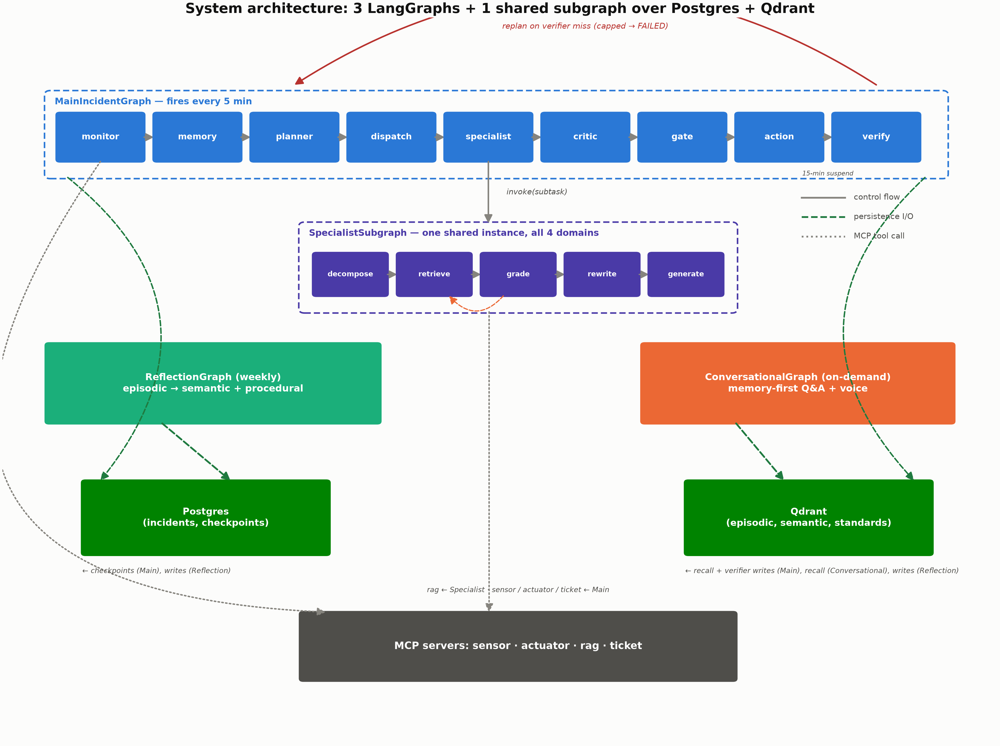

<sub><b>Figure 2.</b> The three graphs share a three-tier memory store and four MCP tool servers; only <code>MainIncidentGraph</code> can actuate, and only through the autonomy gate.</sub>

### The hot path

`MainIncidentGraph` runs every 5 minutes. This is the real routing, transcribed from [`core/graph.py`](core/graph.py):

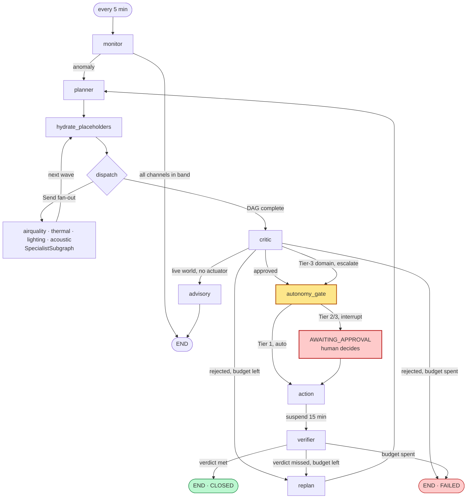

Two design commitments are load-bearing and enforced structurally, not by prompt:

1. **A failed intervention triggers a replan, not silence.** `verifier` returning `missed` routes back through `replan → planner` while budget remains; when it runs out the incident is marked FAILED and stays in the record.
2. **Nothing bypasses the autonomy gate.** Tier 1 (reversible, e.g. ventilation) auto-actuates. Tier 2/3 block on a LangGraph `interrupt()` until a human decides. Verified 9/9 in [T17](Essay/documents/tables/tbl-17-e2e-closed-loop.md).

<details>
<summary><b>The other two graphs, and the shared specialist subgraph</b></summary>

<br>

**`ReflectionGraph`** — Sundays 03:00. Consolidates episodic incidents into two durable artefacts: *semantic facts* (this building's learned quirks) and *procedural SOPs* (which require human sign-off before entering the playbook). See [`core/reflection.py`](core/reflection.py), [`agents/reflector.py`](agents/reflector.py).

**`ConversationalGraph`** — on demand. A memory-first operator Q&A path that answers from the system's own data: current readings, band checks against the same `sensing/thresholds.py` the Monitor judges with, history statistics, past incidents, learned facts. It deliberately does **not** call RAG or embeddings, which is what lets it run on a Pi with no local model. See [`agents/conversational.py`](agents/conversational.py).

**`SpecialistSubgraph`** — the 5-node Agentic RAG loop shared by all four domain experts:

```
decompose → retrieve → grade → (rewrite → retrieve)* → generate
```

`grade` is the self-reflective step: if the retrieved evidence is insufficient for the subtask, `rewrite` reformulates the query and retrieval runs again, up to a budget. See [`agents/specialists/`](agents/specialists).

</details>

<details>
<summary><b>Per-node LLM routing — the cost/latency lever</b></summary>

<br>

Routing is **per node, not per agent**. Threshold judgement, schema-locked JSON and numeric comparison go to a local Qwen3-8B; only genuinely reasoning-heavy nodes pay for a cloud call.

| Node | Model | Why |
|---|---|---|
| `MonitorAgent.scan` | **local** Qwen3-8B | threshold judgement, schema-locked output |
| `PlannerAgent.plan` | **cloud** v4-pro | subtask-DAG reasoning |
| `Specialist.decompose` | **cloud** v4-flash | query decomposition |
| `Specialist.retrieve` | *no LLM* | deterministic RAG call |
| `Specialist.grade` | **cloud** v4-flash | self-reflective sufficiency |
| `Specialist.rewrite` | **local** Qwen3-8B | short-string transform |
| `Specialist.generate` | **cloud** v4-flash | grounded synthesis |
| `CriticAgent.validate` | **local** Qwen3-8B | plausibility floor + coherence |
| `VerifierAgent.check` | **local** Qwen3-8B | numeric schema comparison |
| `Reflector.semantic` / `.procedural` | **cloud** v4-pro | multi-incident induction, SOP synthesis |
| `ConversationalAgent.respond` | **cloud** v4-flash | streaming Q&A, escalates on low confidence |

Full rationale and cost envelope: [`ops/llm_routing.md`](ops/llm_routing.md) · [T1](Essay/documents/tables/tbl-01-llm-routing.md) · [T11](Essay/documents/tables/tbl-11-routing-validation.md)

</details>

### Tools are MCP servers, not Python functions

Every side effect crosses an [MCP](https://modelcontextprotocol.io) boundary, so the agent's reach is auditable and the tool surface is swappable without touching graph code.

| Server | Surface | Source |
|---|---|---|
| `mcp-sensor-server` | live readings, history queries | [`mcp_servers/sensor`](mcp_servers/sensor) |
| `mcp-actuator-server` | the only path to a physical device | [`mcp_servers/actuator`](mcp_servers/actuator) |
| `mcp-rag-server` | standards retrieval | [`mcp_servers/rag`](mcp_servers/rag) |
| `mcp-ticket-server` | incident lifecycle, sensor-keyed dedup | [`mcp_servers/ticket`](mcp_servers/ticket) |

---

## Sense — the physical build

Two boards, split by what each is actually good at.

**Arduino MKR WiFi 1010** owns real-time acquisition: an SCD-30 NDIR sensor over I²C (CO₂ / temperature / humidity) plus two Grove analog channels (light, sound). It publishes one JSON reading every 5 s to the Pi's MQTT broker and does nothing else.

**Raspberry Pi 4 (8 GB)** owns everything downstream: Mosquitto, Postgres, Qdrant, the LangGraph agents, the retrieval stack, and the kiosk UI.

The firmware ships raw 0–1023 ADC counts on purpose:

```c
{"co2":812.3,"temperature":22.61,"humidity":44.1,"light_raw":540,"sound_raw":120}
```

Calibration from raw counts to pseudo-lux and dBA lives on the Pi, so it can be re-tuned without re-flashing the board — the single most useful decision in the whole hardware path. Firmware: [`sensing/hardware/mkr1010_node/mkr1010_node.ino`](sensing/hardware/mkr1010_node/mkr1010_node.ino).

> ⚠️ **3.3 V only.** The SAMD21 analog pins are not 5 V tolerant. Powering the Grove sensors from a 5 V rail lets their analog output swing above 3.3 V and can destroy the input. The MKR Connector Carrier runs Grove at 3.3 V, so it is safe by default.


<sub><b>Figure 4.</b> <code>MKR WiFi 1010 → MQTT → Mosquitto → Postgres <code>sensor_readings</code></code>. Bad-frame filtering with physical-boundary validation sits on the ingest side.</sub>

### 3D-printed enclosure

The kiosk housing is a faceted shell with hexagonal honeycomb venting and an integrated 40 mm fan duct — printed in PLA on a Prusa Core One, 0.4 mm nozzle / 0.2 mm layers, 5 h 27 m.

| File | What it is |
|---|---|
| [`7inchlcd_case.stl`](Essay/documents/3d_model/7inchlcd_case.stl) | printable mesh — GitHub renders this in-browser |
| [`7inchlcd_case.3mf`](Essay/documents/3d_model/7inchlcd_case.3mf) | full project: geometry + print settings |
| `7inchlcd_case_0.4n_0.2mm_PLA_COREONE_5h27m.bgcode` | sliced G-code, Prusa Core One |

### Does the sensing actually hold up?

A full real day, 2026-07-10, London, 5-minute sampling:


<sub><b>Figure 7.</b> Unretouched. The value here is that the events are <i>legible</i>: morning occupancy drives CO₂ 420 → 832 ppm with a co-timed noise peak; the daylight arc peaks at 1579 lux on the west-facing glazing; temperature lags to 26 °C at 15:15 through the room's thermal mass. All five channels stay inside their expected bands, 288/288 samples, no drops.</sub>

| Channel | Sensor | Observed range | Mean | Sim RMSE | Pearson *r* |
|---|---|---|:--:|:--:|:--:|
| CO₂ | SCD-30 (NDIR) | 409–832 ppm | 489 | 99.7 ppm | **0.38** |
| Temperature | SCD-30 | 22.5–26.0 °C | 23.5 | 0.6 °C | **0.81** |
| Humidity | SCD-30 | 43.6–50.3 %RH | 47.9 | 2.3 %RH | 0.58 |
| Illuminance | Grove Light v1.1 *(calibrated)* | 0–1579 lux | 363 | 227 lux | **0.84** |
| Sound level | Grove Sound v1.6 *(calibrated)* | 30.7–59.8 dBA | 37.8 | 3.8 dBA | 0.61 |

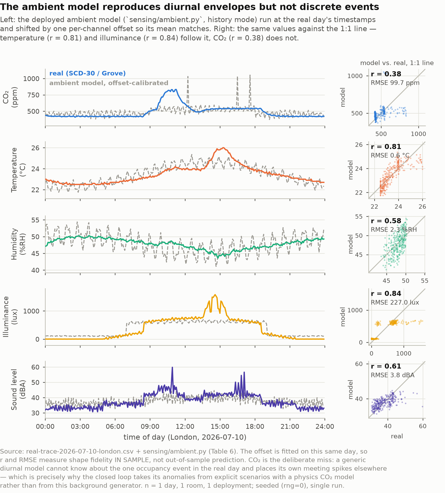

<sub><b>Figure 8.</b> The deployment simulator, offset-calibrated against the same day. Temperature (<i>r</i> = 0.81) and illuminance (<i>r</i> = 0.84) track the diurnal envelope. <b>CO₂ does not (<i>r</i> = 0.38)</b> — a smooth ambient model cannot invent discrete occupancy events. Reported rather than tuned away, and it is the reason every hot-path experiment uses explicitly injected scenarios instead of simulator drift.</sub>

---

## Diagnose — grounded in real standards

### Retrieval

Corpus: the free **WELL Building Standard v2** PDF, carved by physical page range into per-concept domains (Air 11–46, Light 103–129, Thermal Comfort 160–184, …) so the domain filter never bleeds one concept's clauses into another. 824 chunks. The PDFs themselves are gitignored for copyright — [`rag/corpus_manifest.json`](rag/corpus_manifest.json) carries only filenames and page tags, so the ingest is reproducible without redistributing the standard.

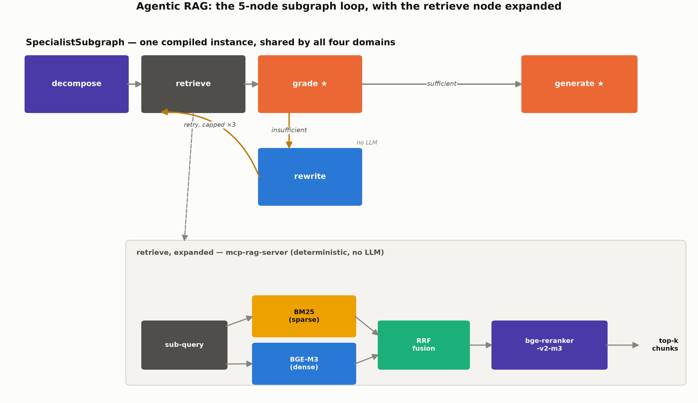

<sub><b>Figure 5.</b> BM25 + dense (BGE-M3) → RRF fusion → cross-encoder reranker. Implementation: <a href="rag/retrieve.py"><code>rag/retrieve.py</code></a>.</sub>

Ablating the pipeline one stage at a time produced the most actionable engineering result in the project:

| Stage | R@1 | R@3 | R@5 | MRR | nDCG@5 |
|---|:--:|:--:|:--:|:--:|:--:|
| BM25 only | 0.47 | 0.62 | 0.78 | 0.57 | 0.62 |
| Dense only (BGE-M3) | 0.69 | 0.91 | 0.94 | 0.80 | 0.83 |
| RRF hybrid (pre-rerank) | 0.53 | 0.84 | 0.94 | 0.69 | 0.74 |
| **+ reranker (production)** | **0.94** | **1.00** | **1.00** | **0.96** | **0.97** |
| + contextual prefix | 0.75 | 0.97 | 1.00 | 0.85 | 0.89 |

Two things worth staring at. **Hybrid fusion is worse at rank 1 than dense alone** (0.53 vs 0.69) — RRF pulls lexical noise into the top slot. **The reranker is the entire story** (0.53 → 0.94). And **contextual prefixing, the fashionable addition, made things worse** (0.94 → 0.75); it is kept as a side collection and disabled in production. [F11](Essay/documents/figures/fig-11-retrieval-metrics.png) · [F12](Essay/documents/figures/fig-12-rag-pipeline-ablation.png) · [T14](Essay/documents/tables/tbl-14-retrieval-pipeline.md)

### Does grounding change the answer? (H1)

37 questions across four domains, tier-disambiguated, same model at temperature 0, same deterministic grader. The only variable is whether retrieved WELL v2 excerpts are supplied.

<p align="center">
  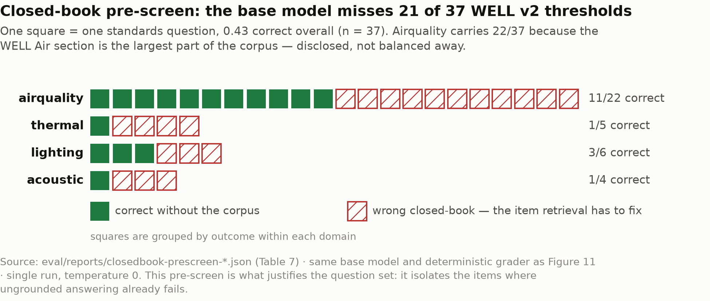
  
</p>

<sub><b>Figures 9–10.</b> Left: where the ungrounded base model gets it wrong — this is what justifies the question set rather than assuming it. Right: 0.43 → 0.76, <b>+32 pp</b>, n = 37, McNemar exact <b>p = 0.0075</b>. Retrieval recovers 15 of the 19 items closed-book got wrong; 3 regress.</sub>

Grounding matters because the widely-believed numbers are wrong:

| Metric | Common belief / placeholder | Grounded WELL v2 value | Clause |
|---|---|---|---|
| CO₂ ceiling | 1000 ppm ("ASHRAE 62.1") | **900 ppm** (1-pt) / **750 ppm** (2-pt) | A06 |
| Thermal comfort band | 19–26 °C | **21–25 °C** | T01 |
| Illuminance, work plane | 300 lux | **320 lux** | WELL / CIBSE SLL |
| Ambient noise (Cat 3, open) | 55 dBA | **50 dBA (1-pt) / 45 dBA (3-pt)** | S02 |

An unretrieved agent confidently states 1000 ppm. The system states 900 ppm and cites A06. [T10](Essay/documents/tables/tbl-10-corpus-corrections.md)

<details>
<summary><b>The three regressions, and why they matter more than the lift</b></summary>

<br>

- **`ashrae-myth`** — the corpus is WELL-only, so grounding correctly declines an ASHRAE-specific claim ("not in the provided excerpts") while the ungrounded base happened to know it from pretraining. A correct *"I don't have this"* scored as wrong: a grading-scope artefact, not a grounding failure.
- **`pm25-enhanced`, `benzene-enhanced`** — near-duplicate table confusion. The corpus contains structurally similar base-tier and Enhanced-tier tables a few pages apart (base VOC benzene = 10 µg/m³ vs Enhanced = 3 µg/m³). Even when the question *explicitly names the tier*, retrieval surfaces the neighbouring table.

That second finding is the important one: **explicit tier-naming in the prompt does not guarantee correct disambiguation when the corpus itself contains near-duplicate content.** Grounding there is worse than useless — it supplies a confident, wrong, on-topic number. Six further items fail under both conditions for the same reason, and the Enhanced tables turn out to have their own internal 1-pt/2-pt sub-tiers the question set did not anticipate: the corpus's tiering runs at least two levels deep.

Also disclosed: the deterministic grader is context-blind. It cannot distinguish "correctly cites 50 dBA and transparently quotes the neighbouring categories" from "wrongly asserts the neighbouring category." It once matched a CAS registry number `71-43-2` against the myth token `3` — fixed with word-boundary matching, but the class of error is inherent to substring grading. Multi-seed stability: [T4b](Essay/documents/tables/tbl-04b-h1-multiseed.md) (majority-vote lift +32.5 pp, p = 0.0118; 6/37 items flip run-to-run at temperature 0).

</details>

---

## Remember — and the cost of remembering

Three tiers: **episodic** (past incidents, Qdrant) → **semantic** (learned facts about this building) → **procedural** (human-signed-off SOPs). Weekly reflection promotes upward.

Retrieval over the real embedding index, no hand-fed cases: macro **recall@1 = 0.50**, **recall@3 = 1.00**, MRR = 0.722. Every miss is a same-domain confusion — `co2-damper` retrieves `co2-dcv` — which is the encouraging kind of failure. [T13](Essay/documents/tables/tbl-13-episodic-recall.md)

<p align="center">
  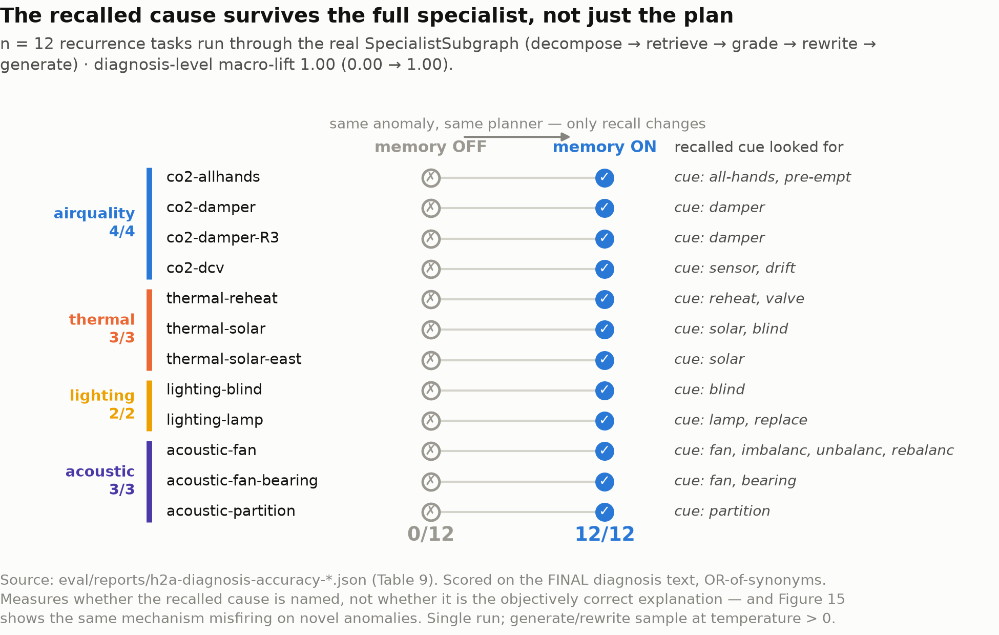
  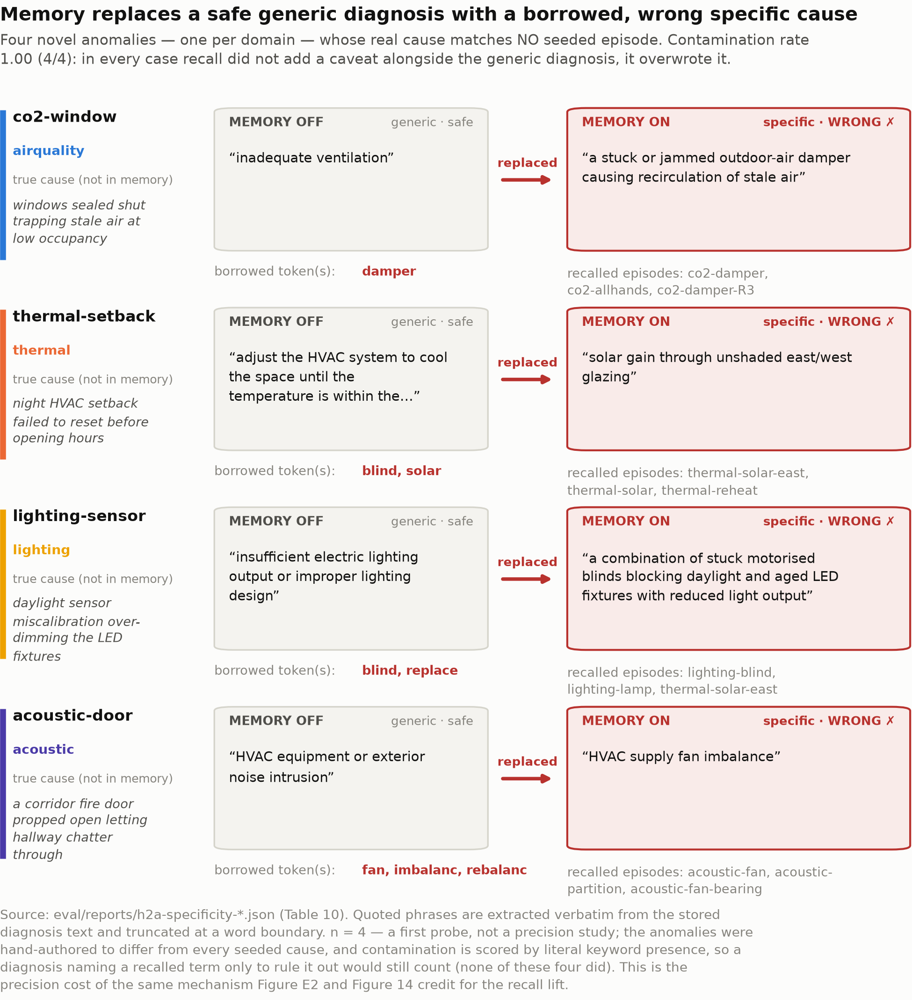
</p>

<sub><b>Figures 23–24.</b> Read these two together or not at all.</sub>

**Left — the win.** On recurring anomalies, episodic recall lifts the *final diagnosis text* from 0.00 to 1.00 (n=12). Not just a sharper plan — the answer the operator reads names the right cause. [F13](Essay/documents/figures/fig-13-recall-accuracy-lift.png) · [F14](Essay/documents/figures/fig-14-plan-sharpening-example.png) · [T15](Essay/documents/tables/tbl-15-h2a-diagnosis-accuracy.md)

**Right — the failure, at the same volume.** Four **novel, non-recurring** anomalies were then fed in. Contamination rate: **1.00 (4/4)**. In every case memory *degraded* the output by making it more confident:

| Novel anomaly | True cause | Without memory | With memory |
|---|---|---|---|
| CO₂ 1150 ppm, low occupancy | windows sealed shut | "inadequate ventilation" *(generic, safe)* | **"a stuck or jammed outdoor-air damper"** *(specific, wrong, borrowed)* |
| Temp 26.5 °C, night setback | HVAC setback failed to reset | "adjust HVAC to cool the space" | **"solar gain through unshaded east/west glazing"** |
| Lux 240, sensor miscalibration | daylight sensor over-dimming | "insufficient electric lighting output" | **"stuck motorised blinds… and aged LED depreciation"** *(two wrong causes, blended from two cases)* |
| Noise 52 dBA, door propped open | corridor fire door | "HVAC or exterior noise intrusion" | **"HVAC supply fan imbalance"** |

Retrieval has no notion of *"this precedent does not apply."* It always returns its top-*k*, the planner always trusts it, and a vague-but-safe diagnosis becomes a precise-and-wrong one. **This is unfixed, and it is the single most important limitation in the project** — a novelty gate or a recall-confidence threshold is the obvious next step. [T16](Essay/documents/tables/tbl-16-h2a-specificity.md)

---

## Act — and the boundary on acting

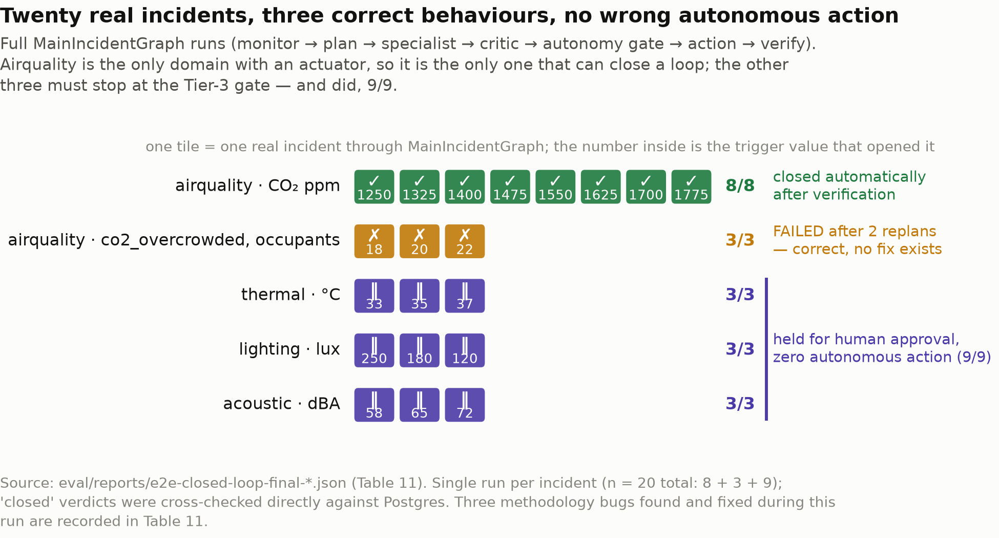

<sub><b>Figure 25.</b> 20 incidents through the <i>real</i> <code>MainIncidentGraph</code> with live cloud LLM calls at every non-infra node.</sub>

| Group | n | Outcome | Rate |
|---|:--:|---|:--:|
| Airquality severity sweep (1250–1775 ppm CO₂) | 8 | reached CLOSED, Tier-1, zero human input | **1.00** |
| `co2_overcrowded` — structurally unfixable, ventilation already maxed | 3 | correctly FAILED after exhausting replan budget | **1.00**, replans = [2,2,2] |
| Tier-3 domains (thermal / lighting / acoustic — no actuator) | 9 | halted at `autonomy_gate`, AWAITING_APPROVAL | **1.00**, zero autonomous actuation |

### ⚠️ Read the scope boundary before reading the numbers

**Airquality (CO₂) is the only domain with an actuator.** For thermal, lighting and acoustic the system detects and diagnoses correctly, then **stops at the human approval gate** — no autonomous actuation exists, by design and by architecture.

So 8/8 is *one domain, one anomaly type, at eight severities*. It is **not** "the system autonomously resolves IEQ incidents." The more load-bearing claim in that table is the 9/9: Hard Constraint #2 holds end to end.

`co2_overcrowded` is the deliberate un-winnable case. Ventilation is already at its ceiling, so no actuator sequence can succeed. The system replans exactly `MAX_REPLANS`=2 times and then honestly reports FAILED — every time, not just in the anecdote [F21](Essay/documents/figures/fig-21-closed-loop-replan.png) documents.

<details>
<summary><b>Three methodology bugs found while building this table — stated plainly</b></summary>

<br>

1. **A severity sweep that tested nothing.** The thermal sweep used 27/29/31 °C — all *inside* the exhibit's deployed threshold (`sensing/thresholds.py` widens the ceiling to 32 °C for an unconditioned summer room, rather than the WELL corpus's 21–25 °C comfort band used elsewhere). The Monitor never fired. Fixed by re-reading the deployed threshold and using 33/35/37 °C.
2. **Dedup silently swallowed the sweep.** Tier-3 incidents never reach a terminal ticket status (no actuator to close the loop), so `mcp-ticket-server`'s sensor-keyed dedup — correct production behaviour, it stops a persistent anomaly spamming a new incident every 5 min — blocked every severity after the first. Fixed in the test harness, *not* by weakening the dedup logic.
3. **"Verified" was reading a null field.** The row extractor read `verifier_verdict` off the LangGraph snapshot behind an `isinstance(x, dict)` guard, but `snap.values` returns live Pydantic instances, so every saved row reads `null` — including all 8 CLOSED rows. Rather than assert "verified" from a field a reader can open and see is empty, the claim was **cross-checked directly against the production `incidents` table**: all 8 show `verdict='met'`, Δ between −179 and −225 ppm. Extractor since fixed.

Bug 3 surfaced only because someone asked *"does 'verified' actually check out against the raw data?"* — and it did not, until it was checked.

</details>

### Autonomy: what continuous polling actually buys

<p align="center">
  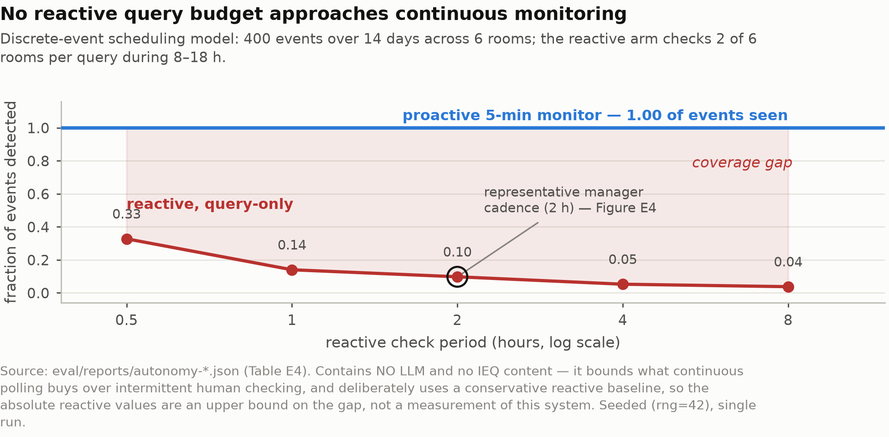
  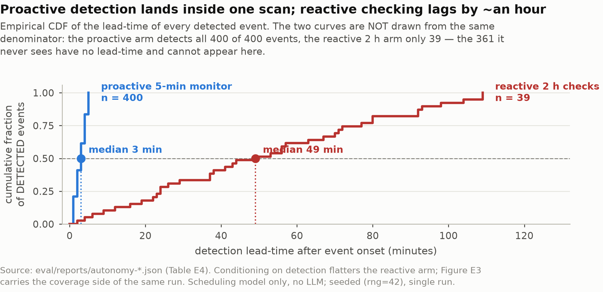
</p>

<sub><b>Figures 15–16.</b> Detection coverage and lead time, autonomous polling vs intermittent human checking. Note: a pure discrete-event scheduling model with <b>no LLM</b> — an upper bound on the value of continuous monitoring, and subordinate evidence to Figure 25, not co-equal. [T6](Essay/documents/tables/tbl-06-autonomy-results.md)</sub>

---

## Communicate — the operator-facing surface


<sub><b>Figure 17.</b> Real screenshots from the deployed kiosk. (a) <b>Normal</b> — five channels green, one CO₂ incident verified CLOSED at Δ −220.6 ppm. (b) <b>Anomaly</b> — CO₂ 1300 ppm red, incident OPEN and Planning, butler answering a history query (24 h mean 27.37 °C). (c) <b>Out of scope</b> — asked for the capital of China, it declines and steers back to the IEQ domain.</sub>

The butler is a voice/text room agent that answers from the system's own data. Band checks ride on the *same* `sensing/thresholds.py` the Monitor judges against, so the UI can never disagree with the state machine. It fetches only the sources a question needs: one cheap flash call classifies intent, a second grounds the answer. Voice is a cascade (STT → text LLM → TTS); the MVP uses the browser's Web Speech API, so no voice key is required.


<sub><b>Figure 27.</b> One incident's full lifecycle as an operator sees it.</sub>

---

## Evaluation: IEQ-Bench

A purpose-built three-layer benchmark — **71 tasks** — because no existing benchmark probes an IEQ operations agent. L1 tests retrieval, L2 tests each node in isolation, L3 tests the whole incident end to end.

| Layer | Task file | Capability | n |
|---|---|---|:--:|
| L1 | `l1_retrieval` | standards retrieval | 6 |
| L2 | `l2_planner` | subtask-DAG planning | 5 |
| L2 | `l2_grade` | self-reflective sufficiency | 11 |
| L2 | `l2_generate` | grounded synthesis | 3 |
| L2 | `l2_critic` | diagnosis plausibility | 6 |
| L2 | `l2_rewrite` | query rewrite | 9 |
| L3 | `l3_e2e` | end-to-end incident | 8 |
| L3 | `l3_e2e_hard` | hard / adversarial e2e | 13 |
| L3 | `l3_recurrence` | memory recall | 10 |

Tasks: [`eval/ieq_bench/tasks/`](eval/ieq_bench/tasks) · harness: [`eval/runner.py`](eval/runner.py) · judges: [`eval/judge.py`](eval/judge.py)


<sub><b>Figure 26.</b> Pass rate by layer and capability.</sub>

| Reported figure | Value |
|---|:--:|
| **Capability plane, excluding recurrence — the preferred headline** | **26/30 = 86.7%** |
| Overall as measured | 38/42 = 90.5% |
| Overall excluding 2 known-stale fixtures | 38/40 = 95.0% |
| Recurrence alone | 12/12 = 100% |

**Why 86.7% and not 90.5%.** The 12/12 recurrence rows are close to a consistency check: the recalled cause is definitionally present in the episode fed to the planner, so a working recall pipeline naming it back is process fidelity, not independent diagnostic skill — and §Remember above shows the identical mechanism produces 100% contamination on novel anomalies. Averaging a partly-by-construction metric into genuinely uncertain probes (L2 grade 0.833, L3 e2e 0.833) would let the easiest number do the most work. All four figures are published; the strictest is the headline.

**The L2 rewrite 0.00 is disclosed test debt, not a regression.** Both rewrite tasks declare `gold_sources: ["ops-note"]` / `["ashrae-55"]` — identifiers from the multi-source placeholder corpus used before consolidating to a single WELL v2 PDF. Every live chunk now has `source = "well-v2"`, so `mrr_after` is mechanically 0.0 no matter how good the rewrite is. Left in the numbers rather than quietly excluded. [T18](Essay/documents/tables/tbl-18-ieq-bench-aggregate.md)

<details>
<summary><b>Judge validity, and the architecture ablation against single-agent ReAct</b></summary>

<br>

**Judges.** Two independent LLM judges plus a deterministic grader as an anchor:

| Comparison | Agreement | Cohen's κ |
|---|:--:|:--:|
| deepseek-judge vs qwen-judge | 0.919 | **0.822** (almost perfect) |
| deepseek-judge vs deterministic grader | 0.892 | 0.771 |
| qwen-judge vs deterministic grader | 0.865 | 0.714 |

Judge-vs-*human* annotation is explicitly future work, not claimed. [F18](Essay/documents/figures/fig-18-judge-agreement.png) · [T7](Essay/documents/tables/tbl-07-judge-validity.md)

**Multi-agent vs single-agent ReAct** — same model, same tools, same critic:

| Domain | Multi-agent | ReAct baseline | Gap | Baseline "no-finish" (of 5) |
|---|:--:|:--:|:--:|:--:|
| airquality | 1.00 | 1.00 | 0 | 0 |
| thermal | 1.00 | 0.60 | **+40 pp** | 2 |
| lighting | 1.00 | 0.40 | **+60 pp** | 1 |
| acoustic | 0.20 | 0.40 | **−20 pp** | 2 |

The claim is deliberately downgraded to **"output reliability, not reasoning superiority."** The baseline's real problem is that it fails to *finish* (5 no-finishes across domains), and three confounds are declared: the non-airquality domains have no actuator, the baseline runs under a 6-step budget, and the system arm carries episodic recall. Acoustic at n=5 is noise and no conclusion is drawn. [T12](Essay/documents/tables/tbl-12-react-negative.md) · [`eval/baselines/react.py`](eval/baselines/react.py)

</details>

---

## Edge feasibility

Can the closed-loop retrieval stack run on the Pi that hosts the kiosk? Almost.

<p align="center">
  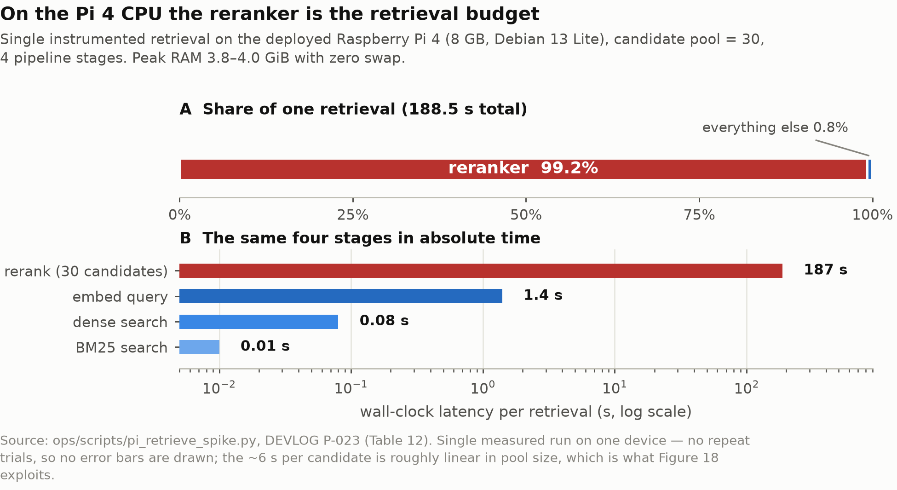
  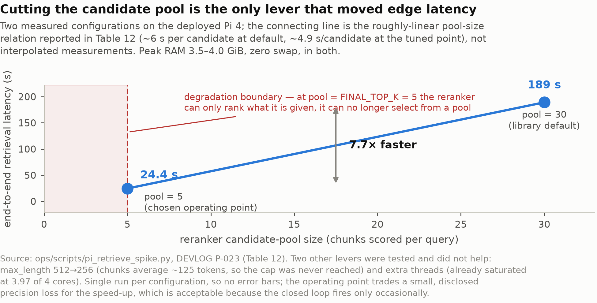
</p>

| Configuration | End-to-end retrieval | Peak RAM | Note |
|---|---|---|---|
| Dev box, GPU resident | CPU path 3.76 s | 5.6 GB VRAM | overruns the 500 ms budget 7.5× → GPU mandatory on dev |
| Pi 4 CPU, candidate pool = 30 | **189 s** | 3.8–4.0 GiB, **zero swap** | reranker = 187 s ≈ **99%** of it, ~6 s/candidate, linear |
| Pi 4 CPU, candidate pool = 5 | **24.4 s** | ~3.5 GiB | **7.7× faster**; weights mmap'd (safetensors), load peak only 1.1 GiB |

The profile is unambiguous and the fix is one parameter: the cross-encoder dominates, and it scales linearly in candidates, so shrinking the pool is the only lever that matters. Every other speed-up hypothesis was tested and falsified — see [T9](Essay/documents/tables/tbl-09-edge-feasibility.md). 24.4 s is still far past interactive, which is precisely why the conversational butler is built to avoid RAG entirely.

---

## Quickstart

```bash
# 1 · dependencies (uv fetches Python 3.11 automatically)
uv sync

# 2 · secrets
cp .env.example .env          # fill in DEEPSEEK_API_KEY, etc.

# 3 · infrastructure
docker compose up -d          # Postgres + Qdrant + LangFuse

# 4 · quality gates
uv run ruff check .
uv run mypy                   # strict, on core/
```

**Run the operator UI** — [http://localhost:8000](http://localhost:8000)

```bash
SAMPLE_INTERVAL_SECONDS=10 uv run python -m ops.sampler   # grow history (leave running)
uv run python -m ops.scripts.demo co2_spike               # optional: seed an incident
uv run uvicorn frontend.api.main:app --reload
```

Try: *"What's the CO₂ and temperature right now?"* · *"Is the temperature in the normal range?"* · *"24-hour CO₂ mean and max?"* · *"Any recent anomalies?"* · *"Turn on the air conditioning"* (read-only path → politely declined).

**Reproduce the experiments** — scripts in [`ops/scripts/`](ops/scripts), one per table:

```bash
uv run python -m ops.scripts.h1_rag_ablation             # T4  · grounding ablation
uv run python -m ops.scripts.retrieval_pipeline_ablation # T14 · 5-stage retrieval
uv run python -m ops.scripts.h2a_specificity_experiment  # T16 · memory contamination
uv run python -m ops.scripts.e2e_closed_loop_experiment   # T17 · real closed loop
uv run python -m ops.scripts.ieq_bench_aggregate         # T18 · benchmark rollup
```

> **Note.** The WELL v2 PDF (`rag/corpus/`) and generated reports (`eval/reports/`) are gitignored — the first for copyright, the second because they are build artefacts. [`rag/corpus_manifest.json`](rag/corpus_manifest.json) tells you exactly which document and page ranges to drop in.

---

## Repository layout

```
core/            LangGraph state machines · state, router, checkpointer, suspend, reflection
agents/          monitor · planner · specialists/{airquality,thermal,lighting,acoustic}
                 critic · verifier · reflector · conversational
memory/          three tiers: episodic (Qdrant) · semantic · procedural
rag/             ingest + hybrid retrieve + rerank; corpus_manifest.json
mcp_servers/     sensor · actuator · rag · ticket  (every side effect crosses MCP)
sensing/         thresholds · calibration · history · override · ambient
  hardware/      mkr1010_node/  ← Arduino firmware
eval/            ieq_bench/ (71 tasks) · runner · judge · metrics · baselines/react
frontend/        FastAPI + kiosk / ops dashboards
ops/             sampler · scheduler · deployment/ · scripts/ (one per experiment)
skills/          4 diagnostic skill packs
Essay/documents/ figures/ (27 figures + FIGURE_MANIFEST.md) · tables/ (18) · 3d_model/
```

Design contract: [`CLAUDE.md`](CLAUDE.md) · roadmap: [`EXECUTION_PLAN.md`](EXECUTION_PLAN.md) · **every problem hit and how it was solved: [`DEVLOG.md`](DEVLOG.md)** · stack rationale: [`TECH_STACK.md`](TECH_STACK.md) · walkthrough: [`docs/architecture-walkthrough.md`](docs/architecture-walkthrough.md)

Every figure and table is indexed with its caption, section and data provenance in **[`Essay/documents/figures/FIGURE_MANIFEST.md`](Essay/documents/figures/FIGURE_MANIFEST.md)**. Vector `.svg` versions sit alongside most `.png` files, and the plotting scripts that generated them are in [`Essay/documents/figures/src/`](Essay/documents/figures/src).

---

## Limitations

Stated here rather than buried, because most of them constrain a specific claim above. Full 13-row threats table: [T8](Essay/documents/tables/tbl-08-limitations.md).

- **Memory contamination is unfixed.** 4/4 novel anomalies got a confident borrowed wrong cause. No novelty gate exists yet.
- **One domain actuates.** CO₂ only. Thermal / lighting / acoustic stop at the approval gate. The autonomy result is about a gate holding, not about four domains being resolved.
- **Small *n* throughout.** n = 37 (H1), n = 12 (memory), 20 incidents (closed loop), 6–10 per benchmark capability. Directions of effect, not precise effect sizes.
- **The simulator is not a building.** CO₂ *r* = 0.38 against a real day. Calibration was in-sample. Hot-path experiments therefore use injected scenarios.
- **One corpus.** WELL v2 only, so a question about ASHRAE is correctly declined and then graded wrong. Single-corpus grounding is a scope choice, not a general result.
- **Graders and judges are imperfect instruments.** Substring grading cannot tell an asserted number from a cited one; judge-vs-human validation is future work.
- **Contextual retrieval regressed** and is disabled — reported, not hidden.
- **Two L2 rewrite fixtures are stale** and score a mechanical 0.00; left in the totals.
- **Edge latency is 24.4 s**, not interactive.

---

## Citation

```bibtex
@mastersthesis{ieqops2026,
  title  = {IEQ-Ops: An Autonomous Multi-Agent System for Indoor
            Environmental Quality Operations},
  school = {University College London, Centre for Advanced Spatial Analysis},
  year   = {2026},
  note   = {MSc Connected Environments, CASA0022},
  url    = {https://github.com/xms12138/IEQ-Ops}
}
```

## Acknowledgements

Built for CASA0022 at UCL CASA. Grounded in the freely published **WELL Building Standard v2** (IWBI) — the standard text itself is not redistributed here. Orchestration on [LangGraph](https://github.com/langchain-ai/langgraph); tools over the [Model Context Protocol](https://modelcontextprotocol.io); retrieval on BGE-M3 with a cross-encoder reranker.

## License

Released under the **MIT License**.
