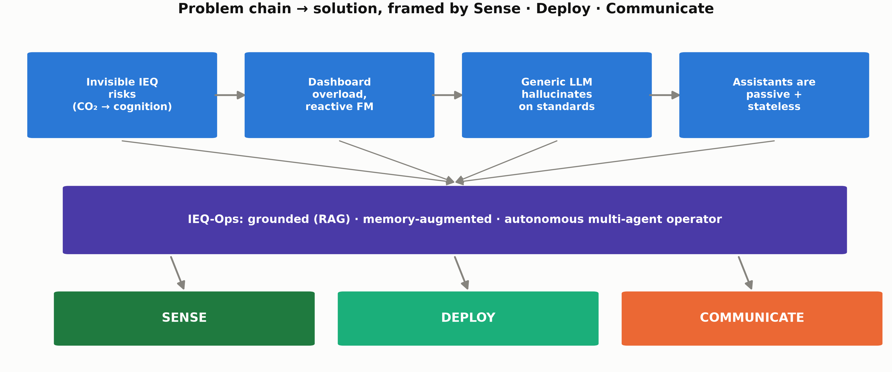
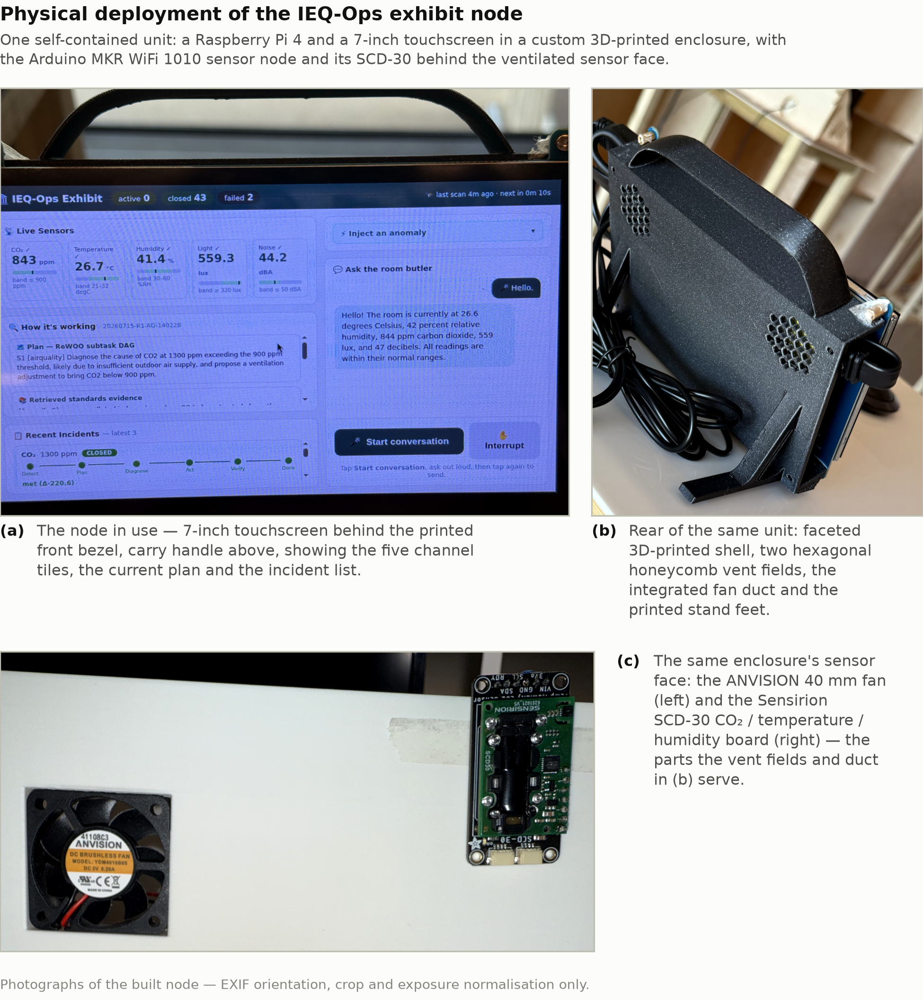
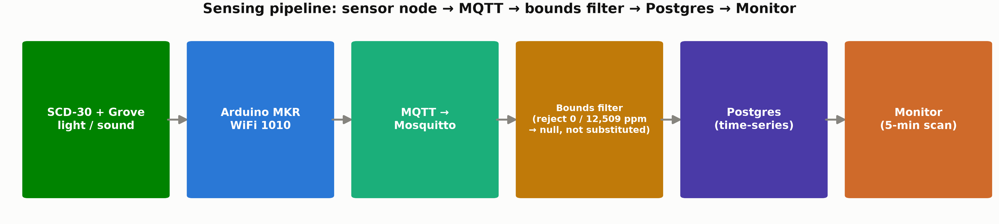
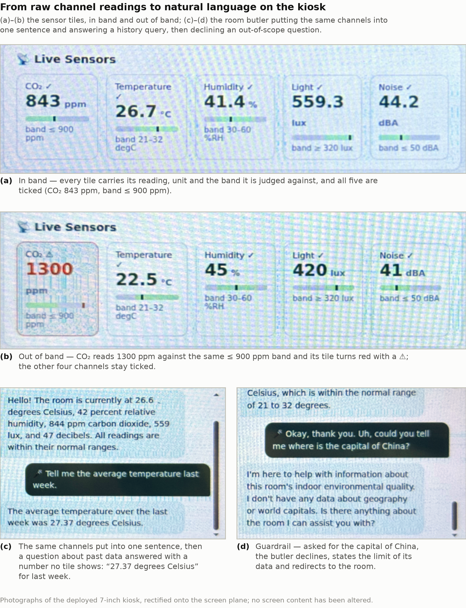
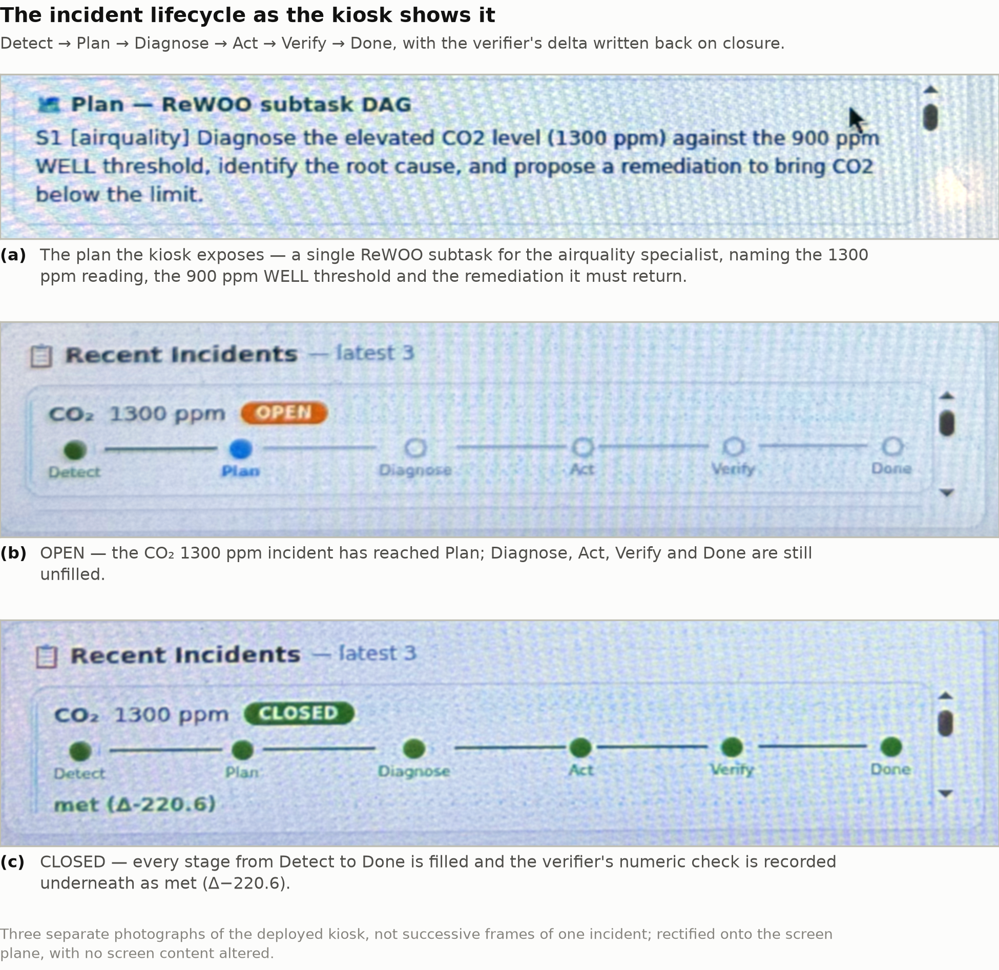
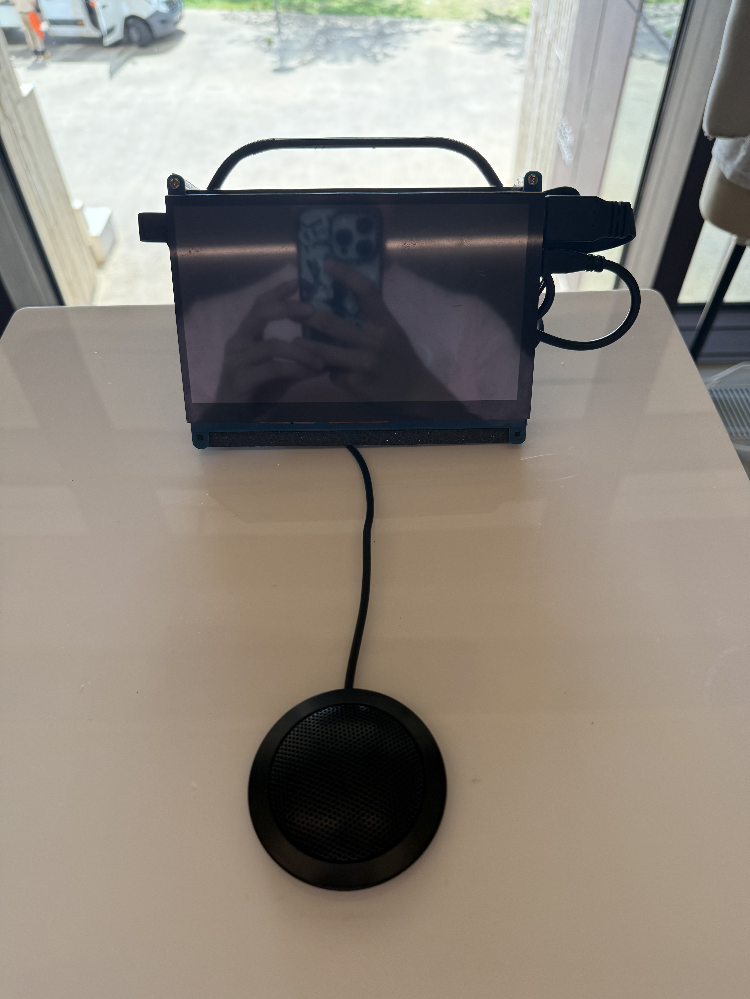
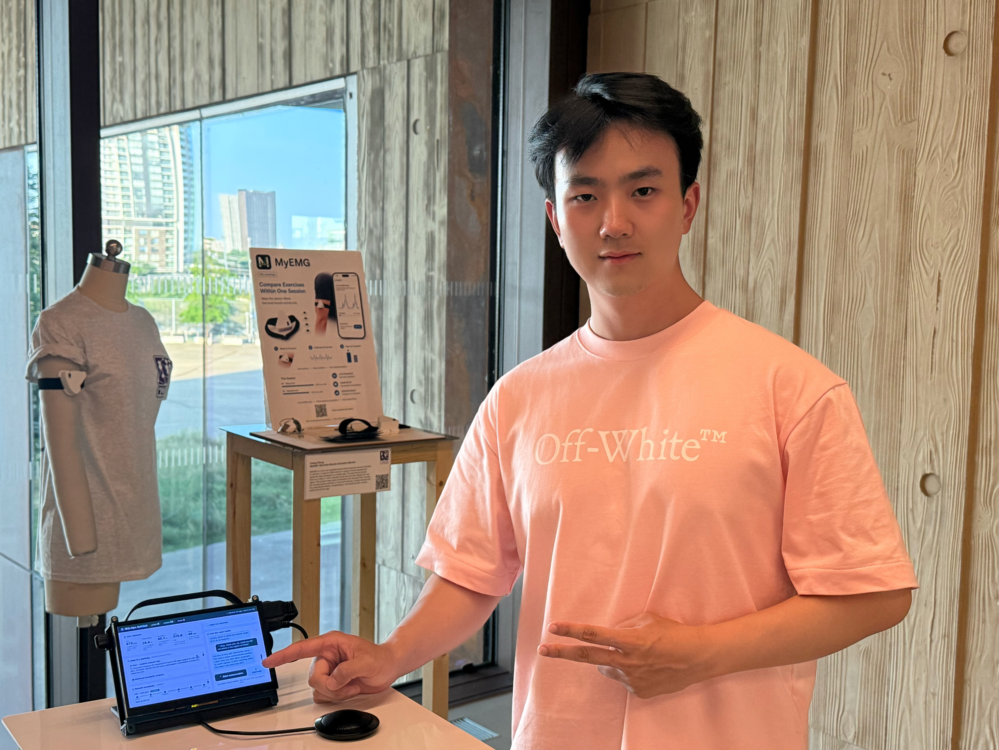
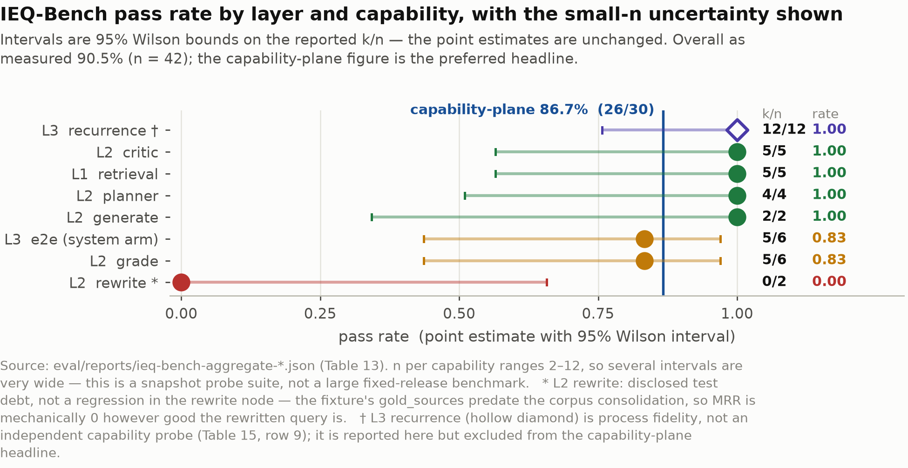
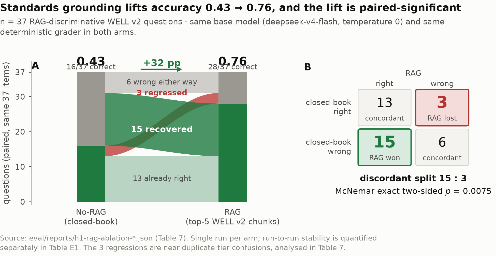

# IEQ-Ops

**An autonomous, closed-loop multi-agent system for indoor environmental quality (IEQ) operations.**

IEQ-Ops watches CO₂, temperature, humidity, light and noise in a room; when a
reading crosses a standards-based threshold, it diagnoses the likely cause
against a real building-standards corpus, acts on the space (or asks a human
first, depending on risk), and then checks 15 minutes later whether the
intervention actually worked. Every closed incident is written to memory, so
the next time the same room misbehaves in the same way, the system recognises
it.

It is **not** a chatbot over sensor data and not a dashboard with an LLM
bolted on. The Q&A "room butler" is a thin, optional interface on top of an
operator that runs whether or not anyone is watching.

Built for my MSc dissertation (CASA0022, UCL Centre for Advanced Spatial
Analysis) and deployed as a self-contained exhibit unit: a Raspberry Pi 4
driving a 7-inch touchscreen kiosk, reading a real Arduino MKR WiFi 1010
sensor node over MQTT.

<p align="center">
  
</p>

---

## Contents

- [Why this exists](#why-this-exists)
- [Architecture](#architecture)
- [Design principles](#design-principles)
- [Hardware](#hardware)
- [The exhibit in action](#the-exhibit-in-action)
- [Evaluation](#evaluation)
- [Implementation status](#implementation-status)
- [Repository layout](#repository-layout)
- [Getting started](#getting-started)
- [Reproducing the evaluation](#reproducing-the-evaluation)
- [Tech stack](#tech-stack)
- [AI-assistance disclosure](#ai-assistance-disclosure)
- [License](#license)

---

## Why this exists

Facilities operators are paged with a raw number ("CO₂: 1420 ppm") and left to
work out what it means, what standard it violates, and what to do about it —
usually from memory or a PDF nobody has open. Off-the-shelf LLM chat layers
help with the *explaining* part but stay stateless and passive: they answer
when asked, forget the answer immediately, and have no way to verify that
whatever a human did in response actually fixed anything.

IEQ-Ops is a case study in the opposite design: sense continuously, ground
every diagnosis in an actual standards document (WELL v2) rather than a
model's prior knowledge, gate every action by how reversible and disruptive
it is, verify the outcome against the same sensors that raised the alarm, and
feed every closed incident back into memory so recurring problems get
recognised — and eventually anticipated — faster over time.

<p align="center">
  
</p>

## Architecture

The system compiles into **three independent LangGraphs** plus **one reusable
subgraph**, persisted to Postgres and Qdrant. They share no in-memory state;
cross-graph communication only happens through the database.

**`MainIncidentGraph`** — the hot path, woken every 5 minutes:

```
monitor → memory_retrieve → planner → dispatch → {airquality|thermal|lighting|acoustic}
        → critic → autonomy_gate → action → (15-min suspend) → verifier
```

- **`monitor`** does pure threshold checking against `sensing/thresholds.py`
  and emits a strictly-typed anomaly record — it never diagnoses. Diagnosis
  hallucination from a threshold node is a real, measured failure mode (see
  [`ops/llm_routing.md`](ops/llm_routing.md)), so the schema boundary is load-bearing, not decorative.
- **`memory_retrieve`** pulls similar closed incidents from episodic memory
  (a plain Qdrant query — no LLM call, so it isn't a graph node in its own right).
- **`planner`** turns the anomaly plus retrieved cases into a subtask DAG
  (Plan-and-Execute + ReWOO: subtasks reference each other's future output
  with placeholders like `#S1.diagnosis`, resolved once the dependency completes).
- **`{domain} specialist`** — one shared, pre-compiled 5-node Agentic RAG
  subgraph (`decompose → retrieve → grade → rewrite → generate`) invoked once
  per subtask with a `domain` parameter that selects the retrieval slice.
  Retries on a failed grade are capped at 3.

  <p align="center">
    
  </p>
- **`critic`** reviews the primary diagnosis before anything is allowed to act
  on it — a deterministic plausibility floor (is the target value physically
  sane?) AND-ed with an LLM coherence check, deliberately blind to the
  retrieved source text so it can't rubber-stamp a citation it never saw.
- **`autonomy_gate` → `action`** — every actuator call is tiered (auto /
  notify / human-approval) before it is allowed to fire.
- **`verifier`** re-reads the same sensors 15 minutes later against the
  specialist's own typed `{target_metric, target_value, target_time_min}`
  prediction, and closes or fails the incident accordingly. The 15-minute
  suspend is a real Postgres-backed checkpoint, so it survives a restart.

**`ReflectionGraph`** — cold path, runs weekly. Consolidates a week of closed
incidents (chunked by domain to stay inside context limits) into semantic
facts ("this building's south rooms run warm in summer") and procedural SOPs
("pre-empt CO₂ before the Tuesday 14:00 all-hands"), the mechanism the memory
experiments below are testing.

**`ConversationalGraph`** — on-demand. A memory-first Q&A "room butler":
intent classification decides which of the system's own data sources a
question needs (current reading / history stats / past incidents / learned
facts), fetches only those, and answers — no RAG call for a plain data
question. Voice is a cascade (STT → text LLM → TTS), not an end-to-end speech
model.

Routing which model runs which node is a first-class design decision, not an
afterthought — see [`ops/llm_routing.md`](ops/llm_routing.md) for the full
per-node table, the capability evidence behind each choice, and the fallback
paths. The short version: nodes that are pure threshold/JSON/numeric work run
on a small local model; anything requiring multi-fact induction, faithfulness
to retrieved text, or causal reasoning is routed to a larger cloud model,
because the small model was measured fabricating causal narratives when asked
to do that job.

A full incident traced end-to-end, including the two or three places people
usually get the design wrong, is in
[`docs/architecture-walkthrough.md`](docs/architecture-walkthrough.md).

## Design principles

1. **Autonomy over chat.** The system runs whether or not a human is
   watching; the conversational layer is a facade on an autonomous core, not
   the core itself.
2. **Closed loop, not open prompt.** Every intervention has a verification
   step. A failed intervention triggers replan, never silence.
3. **Job isolation, not agent debate.** Agents have non-overlapping tool
   access and context, not "personalities" that argue with each other.
4. **Memory should make the system smarter over time.** Three-tier memory
   (episodic → semantic → procedural), consolidated weekly. Whether this
   measurably helps — not just whether it's architecturally elegant — is the
   subject of the H2a experiment below.
5. **Tiered autonomy with hard safety floors.** Reversibility, energy impact,
   and occupant disturbance determine whether an action fires automatically,
   fires with a notification, or blocks on human approval.
6. **Grounded diagnosis, not confident guessing.** A Specialist's `generate`
   step must be grounded in retrieved standards text; a `critic` step vetoes
   diagnoses that are internally inconsistent or physically implausible
   before anything is allowed to act on them.

## Hardware

<p align="center">
  
</p>

The exhibit unit is one self-contained node:

| Part | Role |
|---|---|
| Raspberry Pi 4 (8 GB) | Runs the full stack on-device, including the RAG retrieval pipeline on CPU |
| 7" touchscreen | Kiosk UI — live readings, incident pipeline, Q&A butler |
| Arduino MKR WiFi 1010 | Sensor node, publishes over WiFi/MQTT |
| Sensirion SCD-30 | CO₂ + temperature + humidity (I²C) |
| Grove Light Sensor v1.1 | Relative illuminance (analog) |
| Grove Sound Sensor v1.6 | Relative sound level (analog) |
| Custom 3D-printed enclosure | STL/3MF/G-code in [`sensing/hardware/enclosure/`](sensing/hardware/enclosure/) — print it yourself |

<p align="center">
  
</p>

Firmware: [`sensing/hardware/mkr1010_node/mkr1010_node.ino`](sensing/hardware/mkr1010_node/mkr1010_node.ino)
(copy `arduino_secrets.h.example` to `arduino_secrets.h` and fill in your own
WiFi credentials and broker IP before flashing — never commit that file).
Real-world sensor readings collected from this unit over a full day are in
[`sensing/real_traces/`](sensing/real_traces/), used to calibrate the
simulator (see `fig-08-sim-vs-real` in [`docs/figures/`](docs/figures/)).

The light and sound sensors report relative, uncalibrated values rather than
true lux/dBA — a deliberate, disclosed trade-off for an exhibit build, not a
hidden limitation.

## The exhibit in action

**Demo video** — a walkthrough of the kiosk running live, end to end:

[](https://youtu.be/Q65Io29d08A)

The kiosk shows its own reasoning, not just a number: the live sensor tiles,
the plan it wrote for the current incident, the retrieved standards evidence
behind the diagnosis, and the room butler, all on one screen.

<p align="center">
  
</p>

Every incident the kiosk raises goes through the same six-stage lifecycle,
visibly, on the device:

<p align="center">
  
</p>

A closer look at the node itself — the touchscreen, carry handle and the
conferencing speakerphone that gives the room butler its microphone and
speaker — and the unit on show, presented in person:

<p align="center">
  
  &nbsp;&nbsp;
  
</p>

More photographs and diagrams — including the negative case where a diagnosis
is rejected and the loop fails safe instead of acting — are in
[`docs/figures/`](docs/figures/).

## Evaluation

Everything below is a measured result on the deployed system, scored against
[IEQ-Bench](eval/ieq_bench/) (a purpose-built benchmark of retrieval,
per-node-capability, and end-to-end tasks) plus a set of targeted ablations.
Raw output and full caveats — including the results that did *not* come out
favourably — are in [`eval/results/`](eval/results/); treat every number here
as a point estimate from a small-n case study, not a large-scale claim.

<p align="center">
  
</p>

| Question | Result |
|---|---|
| Overall IEQ-Bench v1 score | **90.5%** pass rate (n = 42; target was ≥ 75%) |
| Does grounding in the standards corpus beat closed-book? | Closed-book **48.6%** → RAG-grounded **81.1%** majority accuracy (n = 37 × 2 seeds, McNemar p = 0.012) |
| Does episodic memory recall fix the *diagnosis*, not just the plan shape? | **0% → 100%** correct root cause on recurring-pattern incidents (n = 12) |
| How good is the memory retrieval itself? | Recall@1 = 0.50, Recall@3 = 1.00, MRR = 0.72 |
| Does the autonomy gate actually hold the line on Tier-3 actions? | **100%** Tier-1 auto-resolve (n = 8); **100%** of Tier-3 actions correctly blocked with zero autonomous execution (n = 9) |
| Is proactive 5-min monitoring actually better than polling? | **100%** incident-detection coverage (median 3-min lead) vs. **9.75%** coverage at 2-hourly reactive polling |
| Is the dual LLM-judge trustworthy? | 91.9% inter-judge agreement (κ = 0.822) against a deterministic grader |

<p align="center">
  
  &nbsp;&nbsp;
  
</p>

Reported honestly, not smoothed over: the multi-agent architecture does
**not** uniformly beat a single-agent ReAct baseline — one domain shows a
negative gap on a small sample — and a negative-control test shows the memory
system can misfire on genuinely novel incidents that share surface keywords
with past cases (100% false-recall on 4 adversarial probes). Both are in
[`eval/results/README.md`](eval/results/README.md) alongside everything else,
together with the rest of the figures referenced above
(retrieval-pipeline ablation, memory macro-lift, detection coverage and
lead-time, judge agreement, edge-latency breakdown) in
[`docs/figures/`](docs/figures/).

## Implementation status

Said plainly, because "it's on a graph" and "it runs end to end on real
hardware" are different claims:

| Component | Current state |
|---|---|
| Closed-loop incident graph (monitor → verify) | ✅ Runs end-to-end on real hardware and on the simulator |
| Three-tier memory + weekly reflection | ✅ Implemented and evaluated (see H2a above) |
| RAG corpus | ✅ Real WELL v2 standard, 824 chunks across 4 domains (not a placeholder corpus) |
| Autonomy tiering | ⚠️ Tier is looked up from a static per-domain table, not computed per action from reversibility/impact yet |
| Failure recovery (critic/verifier reject → replan) | ⚠️ A rejected diagnosis fails the incident safely (no unsafe action fires) but does not yet trigger an automatic replan — that routing exists in the graph design but isn't wired up |
| Actuator coverage | ⚠️ Airquality (ventilation) only; thermal/lighting/acoustic diagnose and verify but have no physical actuator, so they always land on the human-approval tier |
| Skills (progressive-disclosure specialist knowledge) | 📋 Directory structure exists; not yet populated |
| Voice interface | ✅ Real cascade (Qwen3-ASR-Flash → text LLM → Qwen3-TTS-Flash), browser Web Speech fallback |

## Repository layout

```
ieq-ops/
├── core/                   # LangGraph state machine, router, Postgres checkpointer
├── agents/                 # one file per agent role (monitor, planner, critic, verifier, reflector, ...)
│   └── specialists/        # shared Agentic RAG subgraph + thin per-domain wrappers
├── memory/                 # episodic (Qdrant) / semantic / procedural memory
├── rag/                    # ingest (PDF → contextual chunks → embeddings) + retrieval (BM25 + dense + reranker)
├── mcp_servers/            # sensor / actuator / rag / ticket — FastMCP, typed I/O
├── sensing/
│   ├── hardware/           # MKR1010 firmware + 3D-printed enclosure
│   ├── real_traces/        # real sensor data collected from the deployed unit
│   └── simulator/          # physics-based room model, used off real hardware
├── voice/                  # cascade voice provider (STT → LLM → TTS)
├── frontend/               # kiosk UI + operator dashboard (FastAPI + HTMX)
├── eval/
│   ├── ieq_bench/          # the benchmark task set
│   ├── results/            # curated evaluation output (see table above)
│   └── runner.py, judge.py, metrics.py
├── ops/
│   ├── llm_routing.md      # authoritative per-node model selection + rationale
│   ├── prompts/            # every agent prompt, versioned
│   ├── deployment/         # systemd units for the always-on exhibit
│   └── scripts/            # demo / ops CLI utilities
├── docs/
│   ├── architecture-walkthrough.md
│   └── figures/
├── TECH_STACK.md           # technology choices and why
└── docker-compose.yml      # Postgres + Qdrant + LangFuse
```

## Getting started

```bash
# 1. Install dependencies (uv auto-fetches Python 3.11)
uv sync

# 2. Configure secrets
cp .env.example .env   # fill in DEEPSEEK_API_KEY etc.

# 3. Bring up infrastructure
docker compose up -d   # Postgres + Qdrant + LangFuse

# 4. Lint + type-check
uv run ruff check .
uv run mypy            # strict, on core/

# 5. Seed some sensor history, then run a demo incident
uv run python -m ops.sampler &
uv run python -m ops.scripts.demo co2_spike

# 6. Start the web UI at http://localhost:8000
uv run uvicorn frontend.api.main:app --reload
```

The RAG corpus is not bundled (WELL v2 is freely downloadable but
redistribution rights are unclear, so `rag/corpus/` is gitignored). Grab the
standard from IWBI, drop it where `rag/corpus_manifest.json` expects it, and
run `uv run python -m rag.ingest`.

Bringing up the real sensor node instead of the simulator: flash
`sensing/hardware/mkr1010_node/mkr1010_node.ino` with your own
`arduino_secrets.h`, point `SECRET_BROKER` at the host running Mosquitto, and
start `python -m sensing.ingest`.

## Reproducing the evaluation

```bash
uv run python -m eval.runner --help
```

`eval/runner.py` scores the system (and, for the tasks that need it, a
single-shot ReAct baseline) against `eval/ieq_bench/tasks/*.jsonl` using the
dual LLM-judge in `eval/judge.py`, cross-checked against deterministic
graders where one exists (see `judge-validity` in
[`eval/results/`](eval/results/) for how much the two agree). The ablation
runs referenced in the results table above (memory on/off, RAG grounding
on/off, proactive vs. reactive monitoring) sweep the same harness over
different graph/config toggles; `eval/results/README.md` maps each result
file to the question it answers and the raw data behind it.

## Tech stack

Full rationale and rejected alternatives in [`TECH_STACK.md`](TECH_STACK.md).
Short version: LangGraph for orchestration (no `AgentExecutor`, no
multi-agent-debate frameworks), DeepSeek for cloud reasoning, BGE-M3 +
bge-reranker-v2-m3 + BM25 for retrieval, Qdrant for vectors, Postgres for
relational state and LangGraph checkpointing, FastMCP for typed tool servers.

## AI-assistance disclosure

**As a development aid.** Claude Opus 4.8 and Claude Code were utilized as
assistive tools to support the experimental phase. They were used to
brainstorm and refine the experimental schedule, assist in organising the
experimental protocols I had fully specified, and provide code suggestions
and syntax corrections during the implementation of the experimental code.
Visualizations, including charts and tables, were generated with AI
assistance based strictly on the actual experimental data I collected. All
final code is in this public repository, and every experiment can be re-run
from it.

## License

MIT — see [`LICENSE`](LICENSE).
